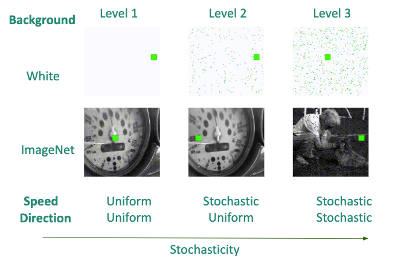

# Video Uncertainty Estimation

* Joint work with Ruoshi Liu and Basile Van Hoorick *

We use video prediction as a proxy task to estimate the uncertainty of video and learn a video representation in a self-supervised manner.
#### For DPC Readme [Link](readme_dpc.md)
#### For Overleaf report [Link](https://www.overleaf.com/1119153987gbbrbbxwgmkb)
### Prerequisites

[installation_script](TPC/installation_script)

## Running the code

### Dense Predictive Coding (DPC)
location: ```TPC/tpc```

**Example**: Train DPC using 4 GPUs, with 3D-ResNet18 backbone, on UCF101 dataset with 128x128 resolution, for 300 epochs.
```
python main.py --gpu 4,5,6,7 --net resnet34 --dataset epic --batch_size 64 --img_dim 128 --epochs 300
```

### Tubelet Predictive Coding (TPC)
location: ```TPC/tpc```

**Example**: Train TPC with 4 GPUs, with 3d ResNet34 as backbone, on epic-kicthen dataset (located on an ssd hard-drive) with 128x128 video resolution, for 300 epochs.
```
python main.py --gpu 0,1,2,3 --net resnet34 --num_seq 8 --seq_len 5 --pred_step 3 --ds 6 --dataset epic --batch_size 64 --img_dim 128 --epochs 300 --distance L2 --distance_type uncertain --weighting True --margin 10 --drive ssd --num_sample 60
```

### Variational Recurrent Neural Network (VRNN) and Conditional Variational Autoencoder (CVAE)
location:```TPC/vae-dpc```

**Example**: Pre-train VRNN-DPC with 3D ResNet-34 as backbone, on the unlabeled Epic-Kitchens dataset, with 128x128 image dimension, for 300 epochs, using a three-phase training schedule (25 + 25 + 250), a beta warm-up of 150 epochs, a fully connected latent space of total size 16, and 1x1 convolutions.
```
python vae_main.py --model vrnn --dataset epic_unlabeled --net resnet34 --vrnn_latent_size 16 --vrnn_kernel_size 1 --vae_kl_weight 1.0 --pred_divers_wt 0.001 --gpu 0,1,2,3 --batch_size 64 --epochs 300 --vae_encoderless_epochs 25 --vae_inter_kl_epochs 25 --vae_kl_beta_warmup 150 --num_seq 8 --pred_step 3 
```

**Example**: Finetune pretrained VRNN-DPC for action *recognition*, both verb and noun by final layers appended onto the last aggregated context of the same network, on a modified Epic-Kitchens dataset (clips end in sync with action segments), for 100 epochs.
```
python test.py --dataset epic_end --class_type both --model vrnn --vrnn_latent_size 16 --vrnn_kernel_size 1 --temporality present --net resnet34 --gpu 0,1 --batch_size 48 --pretrain XXX --epochs 100 --lr 0.0005 --wd 0.0005 --num_seq 5 --pred_step 0
```

**Example**: Finetune pretrained VRNN-DPC for action *anticipation*, both verb and noun by final layers appended onto the last predicted context of the same network, on a modified Epic-Kitchens dataset (clips precede action segments), with VAE encoding enabled, for 100 epochs.
```
python test.py --dataset epic_before --class_type both --model vrnn --vrnn_latent_size 16 --vrnn_kernel_size 1 --temporality future --net resnet34 --gpu 0,1 --batch_size 48 --pretrain XXX --epochs 100 --lr 0.0005 --wd 0.0005 --num_seq 8 --pred_step 3 --vae_encode_train
```

**Example**: Test above finetuned VRNN-DPC using an oracle loss with a varying number of paths, simulating multiple degrees of allowance. Both clean (test) and dirty (validation) data augmentation transforms are evaluated. Results are stored in the model folder.
```
python test.py --dataset epic_before --class_type both --model vrnn --vrnn_latent_size 16 --vrnn_kernel_size 1 --temporality future --net resnet34 --gpu 0,1,2,3 --batch_size 256 --test XXX --num_seq 8 --pred_step 3 --oracle_samples 1,2,3,5,10,20,30,50,100
```


### Flags Explained
| Flags      | Values         | Description |
| ------------- |:-------------:|------------|
| --distance   |  Cosine/**L2** | Score function to compare embeddings|
| --distance-type | Certain/**Uncertain** | Uncertainity with a radius r |
| --weighting | **True**/False | Weight value in the loss function|
| --drive | hdd/**ssd** | Type of drive training data is located (path needs to be specified in the dataset object) |
| --margin | 100 | Margin value in the loss function |
| --num_seq | 8 | Number of video blocks in a sequence |
| --seq_len | 5 | Number of frames in a video block |
| --pred_step | 3 | Number of step to predict |
| --net | **resnet18**/resnet34 | Feature extractor *f* architecture |
| --dataset | epic_unlabeled/epic_before/epic_end | Dataset |
| --ds | 6 | Frame downsample rate |
| --prefix | conv/tmp | Checkpoint log folder name postfix |
| --train_what | last/**all** | (obsolete) |
| --img_dim | 128 | Square video resolution as input to network |
| --new_augment | False | Use data transform that handles 16:9 video better (not yet implemented) |
| --model | **vrnn**/vrnn-i/cvae | VAE-DPC architecture (VRNN-I => prior is standardnormal) |
| --cvae_arch | conv_a/.../**conv_e** | (this matches VRNN) |
| --vrnn_latent_size | 16 | VRNN probabilistic latent space *z_t* dimensionality (no spatial division) |
| --vrnn_kernel_size | 1 | Convolutional layer kernel size (1x1 matches original DPC => spatial cells independent) |
| --vrnn_dropout | 0.1 | Dropout probability in RNN (= GRU cell) for aggregation |
| --vae_kl_weight | 1.0 | Final beta value for KL divergence loss term |
| --vae_no_kl_norm | False | Enable to revert to old normalization (legacy) |
| --vae_encoderless_epochs | 25 | Duration of first training phase (no encoder) |
| --vae_inter_kl_epochs | 25 | Duration of second training phase (no KL penalty) |
| --vae_kl_beta_warmup | 150 | Duration of beta warmup within third training phase (gradual increase of KL penalty) |
| --pred_divers_wt | 0.001 | Cosine similarity weight in loss, among pair of random predictions, to encourage multi-modality |
| --pred_divers_formula | neg/**inv** | Formula to calculate diversity loss (legacy) |
| --test_diversity | False | Enable to evaluate and store mean uncertainty across many paths |
| --paths | 20 | Number of future paths to branch off from *c_t* for diversity estimation |
| --select_best_among | 20 | (incorrectly implemented for now; do not use) |
| --label_fraction | 1.0 | Use this fraction of labels for finetuning (0 < x <= 1) |
| --store_results | False | Enable to perform validation and store all output vectors |
| --oracle_samples | 1 | List of numbers of paths for oracle loss evaluation, e.g. 1,2,3,5 (use in conjunction with --test) |
| --vae_encode_train | False | Finetune on action labels with VAE encoder (recommended to enable for future classification) |
| --diverse_actions | False | Similar to --test_diversity but includes predicted action classes (use in conjunction with --pretrain) |
| --force_context_dropout | False | Enable to use different dropout mask on *c_t* for every path for diversity estimation (see literature) |

## Code Structure
(Note: this is currently not up to date.)
```
├── vae-dpc
│   ├── vae_main.py
│   └── cvae_model.py
├── dpc
│   ├── dataset_3d.py
│   ├── main.py
│   └── model_3d.py
├── eval
│   ├── dataset_3d_lc.py
│   ├── model_3d_lc_present.py
│   ├── model_3d_lc.py
│   ├── test.py
│   └── watch_video.ipynb
├── tpc
│   ├── dataset_3d.py
│   ├── main.py
│   ├── model_3d.py
│   └── uncertainty.py
├── utils
│   ├── augmentation.py
│   ├── diversity_measurement.py
│   ├── epic_data.py
│   ├── merge_plots.py
│   ├── tf2pd.py
│   ├── toy_mnist_creation.py
│   └── utils.py
└── vis
    ├── block_toy
    │   ├── block_toy_F.py
    │   └── block_toy_phi.py
    │   ├── block_toy_phi_radius.py
    ├── diversity.py
    ├── epic
    │   ├── epic_F.py
    │   ├── epic_phi.py
    │   ├── epic_phi_radius.py
    │   └── model_visualize.py
    ├── single_video_uncertainty
    │   ├── epic_videos.csv
    │   └── generate_uncertainty.py
    └── util
        ├── dataset_visualize.py
        └── model_visualize.py
```
## Block Toy Dataset


## License
This project is licensed under the MIT License - see the [LICENSE.md](LICENSE.md) file for details
